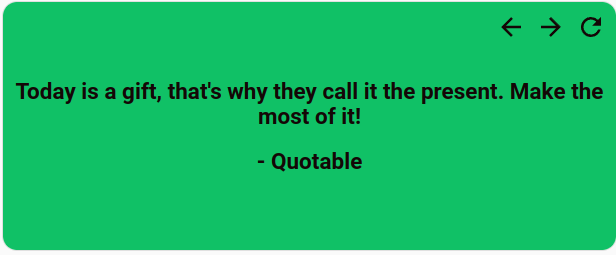
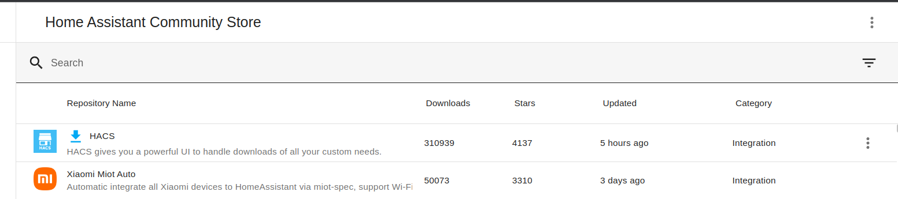
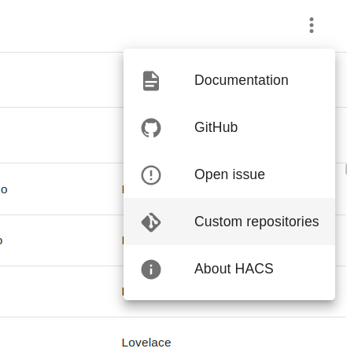

# LOVELACE CARD FOR QUOTABLE INTEGRATION

 

     

## Purpose

Quotable, a free and open-source home assistant integration, shares inspirational quotes to offer a positive start to people's days.

- The goal is to motivate daily tasks and enhance overall well-being. By beginning the day with encouraging quotes, it aids in maintaining a positive and focused mindset, leading to improved productivity and making daily challenges feel more manageable.
- Quotable's user-friendly design ensures that everyone can easily access and enjoy these motivational quotes, turning regular days into more pleasant and satisfying experiences.

---

## Features

- Custom card and text colors
- Select quotes from your favourite authors
- Select quotes from your favourite category/tag
- Select quote refresh interval

---

## Prerequisites

- Home Assistant Community Store (HACS) --> [**Installation guide**](https://hacs.xyz/docs/setup/download/):

- Quotable Integration ( Link here)

---

## Installation
After a successfully installing [**HACS**](https://hacs.xyz) , follow the steps below to install the lovelace card.

1. Go to your HACS dashboard
   

     
   

2. Click on three dots / option menu on the top right
   

     
   

3.

4.
---

## Configuration

1. Go to edit lovelace dashboard
   

     
   

2. Click on "Add card"
   

     
   

3. Search for quotable in the search bar and select
   

     
   

4. Setup initial configuration,( Select card colors, preferred authors, quote categories and refresh interval)
   

     
   

5. Save your card configuration to add card to lovelace dashboard.
   

     
   

