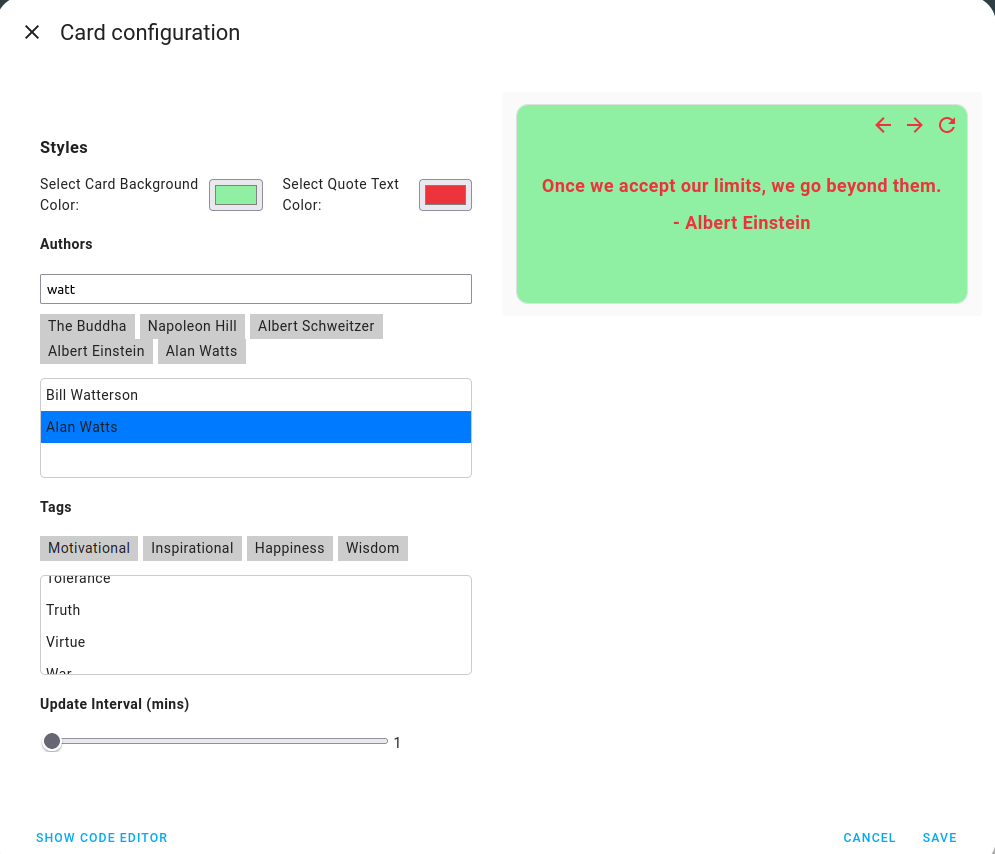

# LOVELACE CARD FOR QUOTABLE INTEGRATION

# Purpose
Quotable, a free and open-source home assistant integration, shares inspirational quotes to offer a positive start to people's days. 

* The goal is to motivate daily tasks and enhance overall well-being. By beginning the day with encouraging quotes, it aids in maintaining a positive and focused mindset, leading to improved productivity and making daily challenges feel more manageable.
* Quotable's user-friendly design ensures that everyone can easily access and enjoy these motivational quotes, turning regular days into more pleasant and satisfying experiences.

# Features:
* Select quotes from a particular author
* Select quotes from a particular category/tag
* Select quote refresh rate
* Custom card and text colors 

# Prerequisites
QUOTABLE INTEGRATION ( Link here?)

# Setup
How will the users be able to upload the files?
How the users will get their file into their system?

# Usage
1. Go to edit lovelace dashboard

  
2. Click on "Add card"

3. Search for quotable in the search bar and select

4. Setup initial configuration,( Select preferred authors, quote categories and update interval)

5. Save your card configuration to add card to lovelace dashboard

